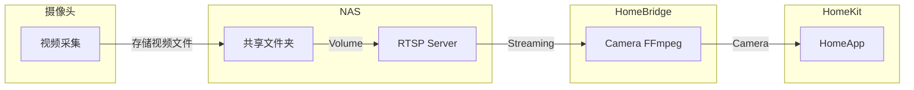

家里使用的小米摄像头买的时间比较早，官方不支持接入到 HomeKit，在上一篇[智能家居建设](/blog/2024/03/03/setting-up-a-smart-home.html)所述在设置小米摄像头影像接入 Apple Home 时需要另辟蹊径，本篇将详述整体思路与实施过程。

### 背景补充

截止到当前时间，无论是通过 HomeAssistant 小米集成还是 HomeBridge 小米插件都没能将小米摄像头的视频流画面稳定接入到 HomeKit，个人判断后续也不太会有通用解，因为后期小米设备一般都官方支持 HomeKit，问题不存在了。另外一个因素是小米摄像头是套闭源系统，无法拿到视频流地址，不过据说可以刷破解固件，怕影响官方特性，没有进一步尝试。

总结一句话问题是：摄像头版本老旧并且不支持刷三方固件（非侵入），如何将视频流画面接入到 Apple Home？

<!--more-->

### 思路

利用摄像头视频同步服务和 NAS 服务，模拟网络摄像头，最后接入 HomeKit：
1. 小米摄像头有个功能可以把采集的视频写入 NAS 网络存储
2. NAS 搭建一个 RTSP 服务，通过 FFmpeg 进行音视频处理及 RTSP 协议推流
3. 通过 HomeBridge FFmpeg 插件实现 RTSP 网络摄像头模拟
4. 接入到 Home App

从根本上来说，是将摄像头采集的视频素材文件通过在服务器架设的 RTSP Server 重新推流，模拟出一个虚拟摄像头接入到 Apple Home



### RTSP 协议

RTSP，英文全称 Real Time Streaming Protocol，RFC2326，实时流传输协议，是 TCP/IP 协议体系中的一个应用层协议，协议主要规定了一对多应用程序如何有效地通过 IP 网络传送多媒体数据。RTSP 体系位于 RTP 和 RTCP 之上（RTCP 用于控制传输，RTP 用于数据传输），服务器端可以自行选择使用 TCP 或 UDP 来传送串流内容。

流媒体传输协议有很多很多种，而主流的摄像头流媒体协议，国际上常用的主要有 HTTP、RTSP、RTMP。由于摄像头属于直播性质，所以对实时性要求较高，国内摄像头厂商如海康、大华品牌的摄像头多采用 RTSP 协议。

RTSP 是一种双向实时数据传输协议，它允许客户端向服务器端发送请求，如回放、快进、倒退等操作。当然 RTSP 可基于 RTP 来传送数据，还可以选择 TCP、UDP、组播 UDP 等通道来发送数据，具有很好的扩展性。它是一种类似于 HTTP 协议的网络应用协议，有其固定的地址格式：

```bash
rtsp://192.168.1.66:554/Streaming
```

对于 RTSP 协议来说，缺省的端口号为 554。当我们在确认流媒体服务器提供的端口号为 554 时，此项可以省略。

生产摄像头的品牌不同，RTSP 的地址也可以不同，如目前市面上常用的海康网络摄像头的 RTSP 地址格式为：

```bash
rtsp://[username]:[password]@[ip]:[port]/[codec]/[channel]/[subtype]/av_stream
```

### NAS 上搭建 RTSP 流服务

这里用到 [mediamtx](https://github.com/bluenviron/mediamtx
) ，在以前是个叫做 rtsp-simple-server 的项目，通过 NAS Docker 安装 latest-ffmpeg 镜像 tag

```bash
docker run --rm -it \
-e MTX_PROTOCOLS=tcp \
-e MTX_WEBRTCADDITIONALHOSTS=192.168.x.x \
-p 8554:8554 \
-p 1935:1935 \
-p 8888:8888 \
-p 8889:8889 \
-p 8890:8890/udp \
-p 8189:8189/udp \
bluenviron/mediamtx
```

**使用 FFmpeg**

FFmpeg 是一款大名鼎鼎的开源音视频编解码工具，命令行很多用法可以参考[官方文档](https://ffmpeg.org/ffmpeg.html)，阮一峰的[这篇教程](https://www.ruanyifeng.com/blog/2020/01/ffmpeg.html)也有介绍用法，这里主要使用 FFmpeg 完成三项工作：
1. 对摄像头采集的原视频进行裁剪，取最近的10秒
2. 视频截图，用作模拟摄像头封面
3. 视频推流到 RTSP 服务器，提供实时视频流服务

**视频裁剪**

小米摄像头原始视频每个有 60 秒，为了提高传输速率，对视频尺寸和编码进行调整，裁剪出 10 秒新视频
```bash
 ffmpeg -y -ss 0 -i input.mp4 -vf scale=1280:-1 -c:v libx264 -c:a aac -t 10 -preset ultrafast output.mp4
```

**视频截图**

```bash
ffmpeg -y -ss 00:00:01 -i output.mp4 -frames:v 1 -update 1 -q:v 5 cover.jpg
```

**视频推流**

使用裁剪出来的 10 秒新视频，推送视频流到 8554 端口，循环播放，参考[官方文档](https://ffmpeg.org/ffmpeg-protocols.html#toc-rtsp)
```bash
ffmpeg -re -stream_loop -1 -i output.mp4 -c copy -f rtsp -rtsp_transport tcp rtsp://localhost:8554/mystream
```

小米摄像头 NAS 存储文件按照时间格式滚动更新，编写脚本按流程进行工作

视频文件存储格式，挂载到 Docker 容器 /media/recordings/ 目录
```bash
/media/recordings/2024041114/23M25S_1712816605.mp4
```

编写任务脚本
```bash
#!/bin/bash
#set -euxo pipefail

# Get latest recording file
target_dir="/media/recordings"
last_subdir=$(ls -d "$target_dir"/* | sort -t/ -k2 | tail -n1)
latest_file=$(ls -lt "$last_subdir"/* | head -n 1 | awk '{print $9}')
echo "Latest file: $latest_file"

# temp file
timestamp=$(date +%s)
video_file="latest_$timestamp.mp4"

# ffmpeg rtsp pid
pid=$(ps aux | grep -v grep | grep mystream | awk '{print $1}')

# cleanup function
cleanup() {
    echo "Cleaning up..."
    rm /root/video/latest_*.mp4

    echo "Reset log file: /root/ffmpeg.log"
    rm /root/ffmpeg.log

    echo "Kill ffmpeg: $pid"
    kill -9 $pid

    echo "Restart ffmpeg to generate rtsp server: Using latest.mp4"
    nohup sh -c "ffmpeg -re -stream_loop -1 -i /root/video/latest.mp4 -c copy -f rtsp -rtsp_transport tcp rtsp://localhost:8554/mystream" > /root/ffmpeg.log 2>&1 &
}

# registe trap
trap 'cleanup; exit' EXIT

process_video() {
    echo "Cut 10s video from the latest recording file"
    ffmpeg -y -ss 0 -i "$latest_file" -vf scale=1280:-1 -c:v libx264 -c:a aac -t 10 -preset ultrafast "/root/video/$video_file" ||
    {
        echo "Failed to create video file from '$latest_file'."
        exit 1
    }

    echo "Cut file success, copy to default mp4"
    cp -f /root/video/$video_file /root/video/latest.mp4 ||
    {
        echo "Failed to copy latest file"
        exit 1
    }

    echo "Generate cover image of latest video"
    ffmpeg -y -ss 00:00:01 -i "/root/video/$video_file" -frames:v 1 -update 1 -q:v 5 "/root/video_cover/cover.jpg" ||
    {
        echo "Failed to generate cover image from '$video_file'."
        exit 1
    }

    echo "Generate error, to start RTSP server with latest file, see ~/rtsp_schedule.log"
    rm /root/video/error.mp4 ||
    {
        echo "Force to run cleanup."
        exit 1
    }
}

process_video
```

### 定时任务模拟实时监控

使用 Docker linux 系统自带的 Cron 定时任务程序每分钟执行一次任务脚本，模拟实时更新的监控视频流。

**Cron** vs **Crond** vs **Crontab**?

> **Cron** is the general name for the service that runs scheduled actions. **Crond** is the name of the daemon that runs in the background and reads crontab files. A **Crontab** is a file containing jobs in the format

```bash
minute hour day-of-month month day-of-week  command
```

使用 crontab -e 命令编辑任务列表

```bash
# do daily/weekly/monthly maintenance
# min   hour    day     month   weekday command
*/15    *       *       *       *       run-parts /etc/periodic/15min
0       *       *       *       *       run-parts /etc/periodic/hourly
0       2       *       *       *       run-parts /etc/periodic/daily
0       3       *       *       6       run-parts /etc/periodic/weekly
0       5       1       *       *       run-parts /etc/periodic/monthly
*/1     *       *       *       *       sh /root/rtsp_schedule.sh >> rtsp_schedule.log
```

启动 Crond 进程在后台运行（daemon）

```bash
/usr/sbin/crond -bS -L /root/crond.log
```

### Camera FFmpeg 插件

添加 [homebridge-camera-ffmpeg](https://github.com/Sunoo/homebridge-camera-ffmpeg) 插件，编辑配置，HomeBridge 会生成一个摄像头对象并接入到 HomeKit

```json
{
    "name": "Camera FFmpeg",
    "cameras": [
        {
            "name": "小米摄像头回放",
            "unbridge": true,
            "videoConfig": {
                "source": "-rtsp_transport tcp -i rtsp://192.168.x.x:8554/mystream",
                "stillImageSource": "-i http://192.168.x.x/recording_cover/cover.jpg",
                "maxWidth": 640,
                "maxHeight": 360,
                "maxFPS": 20,
                "audio": false,
                "debug": false
            }
        }
    ],
    "platform": "Camera-ffmpeg"
}
```

重要属性解释：

* source: (Required) FFmpeg options on where to find and how to decode your camera's video stream. The most basic form is -i followed by your camera's URL.
* stillImageSource: If your camera also provides a URL for a still image, that can be defined here with the same syntax as source. If not set, the plugin will grab one frame from source.

此举也适用于将其他提供 RTSP 流媒体的摄像头接入到 HomeKit。

### 延伸阅读

1. [Streaming Protocols: Everything You Need to Know (Update)](https://www.wowza.com/blog/streaming-protocols#)
2. [RTSP 协议详解](https://zhuanlan.zhihu.com/p/478736595)
3. [什么是 daemon 与服务 （service）](https://wizardforcel.gitbooks.io/vbird-linux-basic-4e/content/148.html)
4. [What steps are needed to stream RTSP from FFmpeg?](https://stackoverflow.com/questions/26999595/what-steps-are-needed-to-stream-rtsp-from-ffmpeg)
5. [家庭基础设施篇三：构筑智能家居生活服务](/blog/2024/03/03/setting-up-a-smart-home.html)
